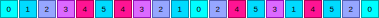
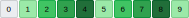
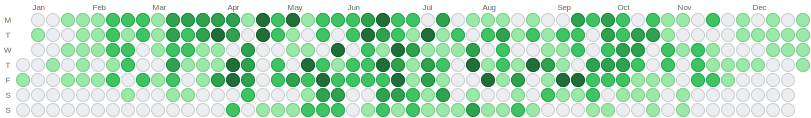

# HeatmapBuilder

> ⚠️ This library is currently in active development. While functional, you may encounter bugs and breaking changes. Use with caution in production environments.

A Ruby gem that generates embeddable SVG heatmap visualizations with GitHub-style calendar layouts and linear progress indicators. Perfect for Rails applications and any project that needs to display activity data in a visual format.


## Features

- GitHub-style calendar layouts for date-based data.
- Linear heatmaps.
- Vector-based output (SVG) for crisp rendering at any resolution.
- Optional numeric values displayed in each cell.
- **Use pre-calculated scores or raw numeric values** - automatic mapping to color scales.
- Custom value-to-score conversion functions for advanced scoring logic.
- Parametric everything: customize cell size, spacing, colors, fonts, etc.
- Rounded corners (and circular cells, if you're into that kind of thing).
- Dynamic palette generation from two colors or manually-specified colors.
- OKLCH color interpolation for clean color transitions and perceptual uniformity.
- **Zero dependencies.**

## Installation

Add this line to your application's Gemfile:

```ruby
gem 'heatmap-builder'
```

And then execute:

    $ bundle

Or install it yourself as:

    $ gem install heatmap-builder

## Usage

### Linear Heatmaps

```ruby
require 'heatmap-builder'

# Generate SVG for daily scores
scores = [0, 1, 2, 3, 4, 5, 2, 1]
svg = HeatmapBuilder.build_linear(scores: scores)

# In a Rails view
<%= raw HeatmapBuilder.build_linear(scores: @daily_scores) %>
```


### Calendar Heatmaps

```ruby
# GitHub-style calendar heatmap
scores_by_date = {
  '2024-01-01' => 2,
  '2024-01-02' => 4,
  '2024-01-03' => 1,
  # ... more dates
}

svg = HeatmapBuilder.build_calendar(scores: scores_by_date)
```


### Using Raw Values Instead of Scores

A **score** is an integer (0 to N-1) that maps directly to a color in your palette. For example, with 5 colors, valid scores are 0-4.

Instead of pre-calculating scores, you can provide raw numeric values (like 45.2, 78, 1000) and let the builder automatically map them to scores using linear distribution:

```ruby
# Linear heatmap with automatic score calculation
values = [10, 25, 50, 75, 100]
svg = HeatmapBuilder.build_linear(
  values: values,
  value_min: 0,    # Optional: explicitly set minimum (defaults to actual min)
  value_max: 100   # Optional: explicitly set maximum (defaults to actual max)
)

# Calendar heatmap with automatic score calculation
values_by_date = {
  Date.new(2024, 1, 1) => 45.2,
  Date.new(2024, 1, 2) => 78.5,
  Date.new(2024, 1, 3) => 12.0
}

svg = HeatmapBuilder.build_calendar(
  values: values_by_date,
  value_min: 0,
  value_max: 100
)
```

The builder will automatically:
- Calculate min/max boundaries from your data if not specified
- Map values to color scores using linear distribution
- Clamp values outside the boundaries
- Handle nil values by treating them as the minimum boundary

You can also provide a custom value-to-score conversion function:

```ruby
# Custom scoring logic
custom_formula = ->(value:, index:, min:, max:, num_scores:) {
  # Your custom logic here
  # Must return integer between 0 and num_scores-1
  ((value - min) / (max - min) * (num_scores - 1)).floor
}

svg = HeatmapBuilder.build_linear(
  values: [10, 20, 30],
  value_to_score: custom_formula
)
```

For calendar heatmaps, the callable receives `date:` parameter instead of `index:`.

### Linear Heatmap Options

All options have defaults and are optional:

```ruby
HeatmapBuilder.build_linear(
  # Data - provide either scores OR values (not both)
  scores: [0, 1, 2, 3, 4],    # Pre-calculated scores (0 to num_colors-1)
  # OR
  values: [10, 25, 50, 75, 100],  # Arbitrary numeric values

  # Value-to-Score Options (only used with values:)
  value_min: 0,               # Minimum boundary (defaults to actual min)
  value_max: 100,             # Maximum boundary (defaults to actual max)
  value_to_score: ->(value:, index:, min:, max:, num_scores:) { ... },  # Custom conversion function

  # Appearance
  cell_size: 10,              # Size of each square in pixels
  cell_spacing: 1,            # Space between squares in pixels
  font_size: 8,               # Font size for score text
  border_width: 1,            # Border width around each cell
  corner_radius: 0,           # Corner radius for rounded cells (0 for square, max: floor(cell_size/2))
  text_color: "#000000",      # Color of score text

  # Colors - can be an array of hex colors or a hash for OKLCH interpolation
  colors: HeatmapBuilder::GITHUB_GREEN,  # Use predefined palette
  # OR manually define color array:
  # colors: %w[#ebedf0 #9be9a8 #40c463 #30a14e #216e39]
  # OR use OKLCH interpolation:
  # colors: { from: "#ebedf0", to: "#216e39", steps: 5 }
)
```

### Calendar Heatmap Options

All options have defaults and are optional:

```ruby
HeatmapBuilder.build_calendar(
  # Data - provide either scores OR values (not both)
  scores: { '2024-01-01' => 2, '2024-01-02' => 4 },  # Pre-calculated scores (0 to num_colors-1)
  # OR
  values: { Date.new(2024, 1, 1) => 45.2, Date.new(2024, 1, 2) => 78.5 },  # Arbitrary numeric values

  # Value-to-Score Options (only used with values:)
  value_min: 0,               # Minimum boundary (defaults to actual min)
  value_max: 100,             # Maximum boundary (defaults to actual max)
  value_to_score: ->(value:, date:, min:, max:, num_scores:) { ... },  # Custom conversion function

  # Appearance
  cell_size: 12,              # Size of each square in pixels
  cell_spacing: 1,            # Space between squares in pixels
  font_size: 8,               # Font size for score text
  border_width: 1,            # Border width around each cell
  corner_radius: 0,           # Corner radius for rounded cells (0 for square, max: floor(cell_size/2))
  text_color: "#000000",      # Color of score text

  # Colors - can be an array of hex colors or a hash for OKLCH interpolation
  colors: HeatmapBuilder::GITHUB_GREEN,  # Use predefined palette
  # OR manually define color array:
  # colors: %w[#ebedf0 #9be9a8 #40c463 #30a14e #216e39]
  # OR use OKLCH interpolation:
  # colors: { from: "#ebedf0", to: "#216e39", steps: 5 }

  # Calendar-specific options
  start_of_week: :monday,     # :sunday, :monday, :tuesday, :wednesday, :thursday, :friday, :saturday
  month_spacing: 5,           # Extra space between months in pixels
  show_month_labels: true,    # Show month names at top
  show_day_labels: true,      # Show day abbreviations on left
  show_outside_cells: false,  # Show inactive cells outside date range

  # Internationalization
  day_labels: %w[S M T W T F S],  # Day abbreviations starting from Sunday
  month_labels: %w[Jan Feb Mar Apr May Jun Jul Aug Sep Oct Nov Dec]  # Month abbreviations
)
```

### Predefined Color Palettes

#### GitHub Green (Default)

```ruby
HeatmapBuilder.build_linear(scores: scores, colors: HeatmapBuilder::GITHUB_GREEN)
```


```ruby
HeatmapBuilder.build_calendar(scores: calendar_data, colors: HeatmapBuilder::GITHUB_GREEN)
```


#### Blue Ocean

```ruby
HeatmapBuilder.build_linear(scores: scores, colors: HeatmapBuilder::BLUE_OCEAN)
```


```ruby
HeatmapBuilder.build_calendar(scores: calendar_data, colors: HeatmapBuilder::BLUE_OCEAN)
```


#### Warm Sunset

```ruby
HeatmapBuilder.build_linear(scores: scores, colors: HeatmapBuilder::WARM_SUNSET)
```


```ruby
HeatmapBuilder.build_calendar(scores: calendar_data, colors: HeatmapBuilder::WARM_SUNSET)
```


#### Purple Vibes

```ruby
HeatmapBuilder.build_linear(scores: scores, colors: HeatmapBuilder::PURPLE_VIBES)
```


```ruby
HeatmapBuilder.build_calendar(scores: calendar_data, colors: HeatmapBuilder::PURPLE_VIBES)
```


#### Red to Green

```ruby
HeatmapBuilder.build_linear(scores: scores, colors: HeatmapBuilder::RED_TO_GREEN)
```


```ruby
HeatmapBuilder.build_calendar(scores: calendar_data, colors: HeatmapBuilder::RED_TO_GREEN)
```


### Dynamic Palettes Generation

Generate custom color palettes from any two colors using OKLCH color space for superior color interpolation:

```ruby
# Generate a 5-step palette from an electric cyan to hot magenta
neon_gradient = {
  from: "#00FFFF",
  to: "#FF1493",
  steps: 5
}

svg = HeatmapBuilder.build_calendar(scores: calendar_data, colors: neon_gradient)
```



The OKLCH color space ensures perceptually uniform color transitions, making gradients appear smooth and natural to the human eye.

### Rounded Corners

Both linear and calendar heatmaps support rounded corners using the `corner_radius` option.

A typical value is around 2 pixels for a subtle rounded effect:

```ruby
# Linear heatmap with rounded corners
HeatmapBuilder.build_linear(
  scores: scores,
  corner_radius: 2,
  cell_size: 18
)
```



The `corner_radius` value must be between 0 (square corners) and `floor(cell_size/2)`. Maximum radius value render circular cells:

```ruby
# Linear heatmap with max radius rounded corners - circular cells
HeatmapBuilder.build_linear(
  scores: scores,
  corner_radius: 9,
  cell_size: 18
)
```


Calendar heatmap examples:

```ruby
# Calendar heatmap with rounded corners
HeatmapBuilder.build_calendar(
  scores: calendar_data,
  corner_radius: 2,
  cell_size: 14
)
```


```ruby
# Calendar heatmap with max radius rounded corners - circular cells
HeatmapBuilder.build_calendar(
  scores: calendar_data,
  corner_radius: 7,
  cell_size: 14
)
```



### I18n

Calendar heatmaps support internationalization by customizing the `day_labels` and `month_labels` options:

```ruby
# French calendar
HeatmapBuilder.build_calendar(
  scores: calendar_data,
  day_labels: %w[D L M M J V S],  # Dimanche, Lundi, Mardi, etc.
  month_labels: %w[Jan Fév Mar Avr Mai Jun Jul Aoû Sep Oct Nov Déc]
)

# German calendar
HeatmapBuilder.build_calendar(
  scores: calendar_data,
  day_labels: %w[S M D M D F S],  # Sonntag, Montag, Dienstag, etc.
  month_labels: %w[Jan Feb Mär Apr Mai Jun Jul Aug Sep Okt Nov Dez]
)

# Italian calendar
HeatmapBuilder.build_calendar(
  scores: calendar_data,
  day_labels: %w[D L M M G V S],  # Domenica, Lunedì, Martedì, etc.
  month_labels: %w[Gen Feb Mar Apr Mag Giu Lug Ago Set Ott Nov Dic]
)

# Spanish calendar
HeatmapBuilder.build_calendar(
  scores: calendar_data,
  day_labels: %w[D L M X J V S],  # Domingo, Lunes, Martes, etc.
  month_labels: %w[Ene Feb Mar Abr May Jun Jul Ago Sep Oct Nov Dic]
)
```

The `day_labels` array should contain 7 elements starting from Sunday, and `month_labels` should contain 12 elements for January through December.

## Development

After checking out the repo, run `bin/setup` to install development dependencies.

### Running Tests

```bash
# Run all tests
rake test

# Run tests with code linting
rake

# Update test snapshots after making intentional changes to output
rake update_snapshots
```

To generate all example SVG files you see in this readme:

```bash
bin/generate_examples
```

## Contributing

Bug reports and pull requests are welcome on GitHub at https://github.com/dreikanter/heatmap-builder. This project is intended to be a safe, welcoming space for collaboration, and contributors are expected to adhere to the [Contributor Covenant](http://contributor-covenant.org) code of conduct.

## License

The gem is available as open source under the terms of the [MIT License](https://opensource.org/licenses/MIT).

## Code of Conduct

Everyone interacting in the HeatmapBuilder project's codebases, issue trackers, chat rooms and mailing lists is expected to follow the [code of conduct](https://github.com/dreikanter/heatmap-builder/blob/main/CODE_OF_CONDUCT.md).
