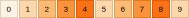
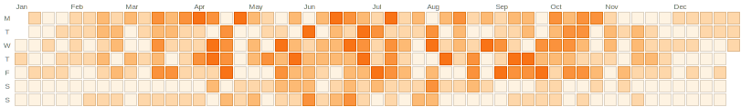
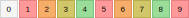

# HeatmapBuilder

> ⚠️ This library is currently in active development. While functional, you may encounter bugs and breaking changes. Use with caution in production environments.

A Ruby gem that generates embeddable SVG heatmap visualizations with GitHub-style calendar layouts and linear progress indicators. Perfect for Rails applications and any project that needs to display activity data in a visual format.


## Features

- GitHub-style calendar layouts for date-based data.
- Linear heatmaps.
- Vector-based output (SVG) for crisp rendering at any resolution.
- Optional numeric values displayed in each cell.
- Parametric everything: customize cell size, spacing, colors, fonts, etc.
- Dynamic palette generation from two colors or manually-specified colors.
- OKLCH color interpolation for clean color transitions and perceptual uniformity.
- **Zero dependencies.**

## Installation

Add this line to your application's Gemfile:

```ruby
gem 'heatmap-builder'
```

And then execute:

    $ bundle

Or install it yourself as:

    $ gem install heatmap-builder

## Usage

### Linear Heatmaps

```ruby
require 'heatmap-builder'

# Generate SVG for daily scores
scores = [0, 1, 2, 3, 4, 5, 2, 1]
svg = HeatmapBuilder.build_linear(scores)

# In a Rails view
<%= raw HeatmapBuilder.build_linear(@daily_scores) %>
```


### Calendar Heatmaps

```ruby
# GitHub-style calendar heatmap
scores_by_date = {
  '2024-01-01' => 2,
  '2024-01-02' => 4,
  '2024-01-03' => 1,
  # ... more dates
}

svg = HeatmapBuilder.build_calendar(scores_by_date)
```


## Configuration

### Linear Heatmap Options

All options have defaults and are optional:

```ruby
HeatmapBuilder.build_linear(scores, {
  # Appearance
  cell_size: 10,              # Size of each square in pixels
  cell_spacing: 1,            # Space between squares in pixels
  font_size: 8,               # Font size for score text
  border_width: 1,            # Border width around each cell
  text_color: "#000000",      # Color of score text

  # Colors - can be an array of hex colors or a hash for OKLCH interpolation
  colors: HeatmapBuilder::GITHUB_GREEN,  # Use predefined palette
  # OR manually define color array:
  # colors: %w[#ebedf0 #9be9a8 #40c463 #30a14e #216e39]
  # OR use OKLCH interpolation:
  # colors: { from: "#ebedf0", to: "#216e39", steps: 5 }
})
```

### Calendar Heatmap Options

All options have defaults and are optional:

```ruby
HeatmapBuilder.build_calendar(scores_by_date, {
  # Appearance
  cell_size: 12,              # Size of each square in pixels
  cell_spacing: 1,            # Space between squares in pixels
  font_size: 8,               # Font size for score text
  border_width: 1,            # Border width around each cell
  text_color: "#000000",      # Color of score text
  # OR manually define color array:
  # colors: %w[#ebedf0 #9be9a8 #40c463 #30a14e #216e39]
  # OR use OKLCH interpolation:
  # colors: { from: "#ebedf0", to: "#216e39", steps: 5 }
  colors: HeatmapBuilder::GITHUB_GREEN,  # Use predefined palette

  # Calendar-specific options
  start_of_week: :monday,     # :sunday, :monday, :tuesday, :wednesday, :thursday, :friday, :saturday
  month_spacing: 5,           # Extra space between months in pixels
  show_month_labels: true,    # Show month names at top
  show_day_labels: true,      # Show day abbreviations on left
  show_outside_cells: false,  # Show inactive cells outside date range

  # Internationalization
  day_labels: %w[S M T W T F S],  # Day abbreviations starting from Sunday
  month_labels: %w[Jan Feb Mar Apr May Jun Jul Aug Sep Oct Nov Dec]  # Month abbreviations
})
```

### Color Mapping

- Score `0`: Uses the first color (typically light gray)
- Score `1+`: Cycles through remaining colors based on score value

### Predefined Color Palettes

#### GitHub Green (Default)

```ruby
HeatmapBuilder.build_linear(scores, colors: HeatmapBuilder::GITHUB_GREEN)
```


```ruby
HeatmapBuilder.build_calendar(calendar_data, colors: HeatmapBuilder::GITHUB_GREEN)
```


#### Blue Ocean

```ruby
HeatmapBuilder.build_linear(scores, colors: HeatmapBuilder::BLUE_OCEAN)
```


```ruby
HeatmapBuilder.build_calendar(calendar_data, colors: HeatmapBuilder::BLUE_OCEAN)
```


#### Warm Sunset

```ruby
HeatmapBuilder.build_linear(scores, colors: HeatmapBuilder::WARM_SUNSET)
```



```ruby
HeatmapBuilder.build_calendar(calendar_data, colors: HeatmapBuilder::WARM_SUNSET)
```



#### Purple Vibes

```ruby
HeatmapBuilder.build_linear(scores, colors: HeatmapBuilder::PURPLE_VIBES)
```


```ruby
HeatmapBuilder.build_calendar(calendar_data, colors: HeatmapBuilder::PURPLE_VIBES)
```


#### Red to Green

```ruby
HeatmapBuilder.build_linear(scores, colors: HeatmapBuilder::RED_TO_GREEN)
```



```ruby
HeatmapBuilder.build_calendar(calendar_data, colors: HeatmapBuilder::RED_TO_GREEN)
```


### Dynamic Palettes Generation

Generate custom color palettes from any two colors using OKLCH color space for superior color interpolation:

```ruby
# Generate a 5-step palette from red to blue
custom_colors = {
  from: "#ff0000",
  to: "#0000ff",
  steps: 5
}

# Linear example with custom palette
svg = HeatmapBuilder.build_linear(scores, colors: custom_colors)
```

The OKLCH color space ensures perceptually uniform color transitions, making gradients appear smooth and natural to the human eye.

### I18n

Calendar heatmaps support internationalization by customizing the `day_labels` and `month_labels` options:

```ruby
# French calendar
HeatmapBuilder.build_calendar(calendar_data, {
  day_labels: %w[D L M M J V S],  # Dimanche, Lundi, Mardi, etc.
  month_labels: %w[Jan Fév Mar Avr Mai Jun Jul Aoû Sep Oct Nov Déc]
})

# German calendar
HeatmapBuilder.build_calendar(calendar_data, {
  day_labels: %w[S M D M D F S],  # Sonntag, Montag, Dienstag, etc.
  month_labels: %w[Jan Feb Mär Apr Mai Jun Jul Aug Sep Okt Nov Dez]
})

# Italian calendar
HeatmapBuilder.build_calendar(calendar_data, {
  day_labels: %w[D L M M G V S],  # Domenica, Lunedì, Martedì, etc.
  month_labels: %w[Gen Feb Mar Apr Mag Giu Lug Ago Set Ott Nov Dic]
})

# Spanish calendar
HeatmapBuilder.build_calendar(calendar_data, {
  day_labels: %w[D L M X J V S],  # Domingo, Lunes, Martes, etc.
  month_labels: %w[Ene Feb Mar Abr May Jun Jul Ago Sep Oct Nov Dic]
})
```

The `day_labels` array should contain 7 elements starting from Sunday, and `month_labels` should contain 12 elements for January through December.

## Development

After checking out the repo, run `bin/setup` to install development dependencies. Run tests with:

```bash
ruby -Ilib:test test/heatmap_builder_test.rb
```

To install this gem onto your local machine, run `bundle exec rake install`.

To generate all example SVG files you see in this readme:

```bash
bin/generate_examples
```

## Contributing

Bug reports and pull requests are welcome on GitHub at https://github.com/dreikanter/heatmap-builder. This project is intended to be a safe, welcoming space for collaboration, and contributors are expected to adhere to the [Contributor Covenant](http://contributor-covenant.org) code of conduct.

## License

The gem is available as open source under the terms of the [MIT License](https://opensource.org/licenses/MIT).

## Code of Conduct

Everyone interacting in the HeatmapBuilder project's codebases, issue trackers, chat rooms and mailing lists is expected to follow the [code of conduct](https://github.com/dreikanter/heatmap-builder/blob/main/CODE_OF_CONDUCT.md).
