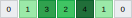
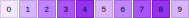
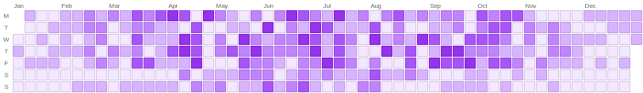
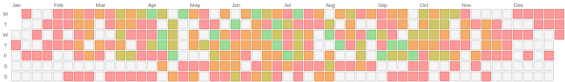
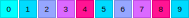
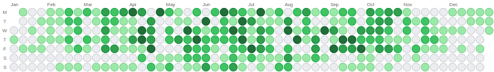

# HeatmapBuilder

> ⚠️ This library is currently in active development. While functional, you may encounter bugs and breaking changes. Use with caution in production environments.

A Ruby gem that generates embeddable SVG heatmap visualizations with GitHub-style calendar layouts and linear progress indicators. Perfect for Rails applications and any project that needs to display activity data in a visual format.


## Features

- GitHub-style calendar layouts for date-based data.
- Linear heatmaps.
- Vector-based output (SVG) for crisp rendering at any resolution.
- Optional numeric values displayed in each cell.
- **Use pre-calculated scores or raw numeric values** - automatic mapping to color scales.
- Custom value-to-score conversion functions for advanced scoring logic.
- Parametric everything: customize cell size, spacing, colors, fonts, etc.
- Rounded corners (and circular cells, if you're into that kind of thing).
- Dynamic palette generation from two colors or manually-specified colors.
- OKLCH color interpolation for clean color transitions and perceptual uniformity.
- **Zero dependencies.**

## Installation

Add this line to your application's Gemfile:

```ruby
gem 'heatmap-builder'
```

And then execute:

    $ bundle

Or install it yourself as:

    $ gem install heatmap-builder

## Usage

### Linear Heatmaps

```ruby
require 'heatmap-builder'

# Generate SVG for daily scores
scores = [0, 1, 2, 3, 4, 5, 2, 1]
svg = HeatmapBuilder.build_linear(scores: scores)

# In a Rails view
<%= raw HeatmapBuilder.build_linear(scores: @daily_scores) %>
```



### Calendar Heatmaps

```ruby
# GitHub-style calendar heatmap
scores_by_date = {
  '2024-01-01' => 2,
  '2024-01-02' => 4,
  '2024-01-03' => 1,
  # ... more dates
}

svg = HeatmapBuilder.build_calendar(scores: scores_by_date)
```


### Linear Heatmap Options

You must provide either `scores:` or `values:` (but not both). All other options are optional keyword arguments with sensible defaults.

**Data options:**

- `scores` - Array of pre-calculated scores (integers from 0 to number of colors minus 1). Required if `values` is not provided.
- `values` - Array of arbitrary numeric values to be automatically mapped to scores. Required if `scores` is not provided. See [Using Raw Values Instead of Scores](#using-raw-values-instead-of-scores).

**Value-to-score conversion options** (only used with `values:`):

- `value_min` - Minimum boundary for value-to-score mapping. Defaults to the minimum value in your data.
- `value_max` - Maximum boundary for value-to-score mapping. Defaults to the maximum value in your data.
- `value_to_score` - Custom callable for value-to-score conversion. Receives `value:`, `index:`, `min:`, `max:`, `num_scores:` parameters and must return an integer between 0 and `num_scores - 1`. See [Custom Scoring Logic](#custom-scoring-logic) for details.

**Appearance options:**

- `cell_size` - Size of each square in pixels. Defaults to 10.
- `cell_spacing` - Space between squares in pixels. Defaults to 1.
- `font_size` - Font size for score text in pixels. Defaults to 8.
- `border_width` - Border width around each cell in pixels. Defaults to 1.
- `corner_radius` - Corner radius for rounded cells. Must be between 0 (square corners) and `floor(cell_size/2)` (circular cells). Values outside this range are automatically clamped. Defaults to 0.
- `text_color` - Color of score text as a hex string. Defaults to `"#000000"` (black).

**Color options:**

- `colors` - Color palette for the heatmap. Can be a predefined palette constant (e.g., `HeatmapBuilder::GITHUB_GREEN`), an array of hex color strings (e.g., `%w[#ebedf0 #9be9a8 #40c463]`), or a hash for OKLCH interpolation (e.g., `{ from: "#ebedf0", to: "#216e39", steps: 5 }`). Defaults to `HeatmapBuilder::GITHUB_GREEN`. See [Predefined Color Palettes](#predefined-color-palettes) and [Dynamic Palettes Generation](#dynamic-palettes-generation).

### Calendar Heatmap Options

You must provide either `scores:` or `values:` (but not both). All other options are optional keyword arguments with sensible defaults.

**Data options:**

- `scores` - Hash of pre-calculated scores by date (integers from 0 to number of colors minus 1). Keys can be Date objects or date strings (e.g., `'2024-01-01'`). Required if `values` is not provided.
- `values` - Hash of arbitrary numeric values by date to be automatically mapped to scores. Keys can be Date objects or date strings. Required if `scores` is not provided. See [Using Raw Values Instead of Scores](#using-raw-values-instead-of-scores).

**Value-to-score conversion options** (only used with `values:`):

- `value_min` - Minimum boundary for value-to-score mapping. Defaults to the minimum value in your data.
- `value_max` - Maximum boundary for value-to-score mapping. Defaults to the maximum value in your data.
- `value_to_score` - Custom callable for value-to-score conversion. Receives `value:`, `date:`, `min:`, `max:`, `num_scores:` parameters and must return an integer between 0 and `num_scores - 1`. See [Custom Scoring Logic](#custom-scoring-logic) for details.

**Appearance options:**

- `cell_size` - Size of each square in pixels. Defaults to 12.
- `cell_spacing` - Space between squares in pixels. Defaults to 1.
- `font_size` - Font size for labels in pixels. Defaults to 8.
- `border_width` - Border width around each cell in pixels. Defaults to 1.
- `corner_radius` - Corner radius for rounded cells. Must be between 0 (square corners) and `floor(cell_size/2)` (circular cells). Values outside this range are automatically clamped. Defaults to 0.
- `text_color` - Color of label text as a hex string. Defaults to `"#000000"` (black).

**Color options:**

- `colors` - Color palette for the heatmap. Can be a predefined palette constant (e.g., `HeatmapBuilder::GITHUB_GREEN`), an array of hex color strings (e.g., `%w[#ebedf0 #9be9a8 #40c463]`), or a hash for OKLCH interpolation (e.g., `{ from: "#ebedf0", to: "#216e39", steps: 5 }`). Defaults to `HeatmapBuilder::GITHUB_GREEN`. See [Predefined Color Palettes](#predefined-color-palettes) and [Dynamic Palettes Generation](#dynamic-palettes-generation).

**Calendar-specific options:**

- `start_of_week` - First day of the week. One of `:sunday`, `:monday`, `:tuesday`, `:wednesday`, `:thursday`, `:friday`, `:saturday`. Defaults to `:monday`.
- `month_spacing` - Extra horizontal space between months in pixels. Defaults to 5.
- `show_month_labels` - Show month names at the top of the calendar. Defaults to `true`.
- `show_day_labels` - Show day abbreviations on the left side of the calendar. Defaults to `true`.
- `show_outside_cells` - Show cells outside the date range with inactive styling. Defaults to `false`.

**Internationalization options:**

- `day_labels` - Array of day abbreviations starting from Sunday (7 elements). Defaults to `%w[S M T W T F S]`. See [I18n](#i18n).
- `month_labels` - Array of month abbreviations from January to December (12 elements). Defaults to `%w[Jan Feb Mar Apr May Jun Jul Aug Sep Oct Nov Dec]`. See [I18n](#i18n).

### Using Raw Values Instead of Scores

A **score** is an integer (0 to N-1) that maps directly to a color in your palette. For example, with 5 colors, valid scores are 0-4.

Instead of pre-calculating scores, you can provide raw numeric values (like 45.2, 78, 1000) and let the builder automatically map them to scores using linear distribution:

```ruby
# Linear heatmap with automatic score calculation
values = [10, 25, 50, 75, 100]
svg = HeatmapBuilder.build_linear(
  values: values,
  value_min: 0,    # Optional: explicitly set minimum (defaults to actual min)
  value_max: 100   # Optional: explicitly set maximum (defaults to actual max)
)

# Calendar heatmap with automatic score calculation
values_by_date = {
  Date.new(2024, 1, 1) => 45.2,
  Date.new(2024, 1, 2) => 78.5,
  Date.new(2024, 1, 3) => 12.0
}

svg = HeatmapBuilder.build_calendar(
  values: values_by_date,
  value_min: 0,
  value_max: 100
)
```

The builder will automatically:
- Calculate min/max boundaries from your data if not specified
- Map values to color scores using linear distribution
- Clamp values outside the boundaries
- Handle nil values by treating them as the minimum boundary

### Custom Scoring Logic

By default, values are mapped to scores using linear distribution. You can provide a custom value-to-score conversion function for different behaviors like logarithmic scales, exponential curves, or custom thresholds.

The callable receives these parameters:
- `value:` - The current value being converted
- `index:` or `date:` - The position in the data (linear heatmaps use `index:`, calendar heatmaps use `date:`)
- `min:` - The minimum boundary value
- `max:` - The maximum boundary value
- `num_scores:` - The number of available scores (length of color palette)

The function must return an integer between 0 and `num_scores - 1`.

Custom scoring logic - linear distribution example:

```ruby
linear_formula = ->(value:, index:, min:, max:, num_scores:) {
  ((value - min) / (max - min) * (num_scores - 1)).floor
}

svg = HeatmapBuilder.build_linear(
  values: [10, 20, 30],
  value_to_score: linear_formula
)
```

Logarithmic scale for data with wide range (e.g., 1 to 10000):

```ruby
logarithmic_formula = ->(value:, index:, min:, max:, num_scores:) {
  return 0 if value <= 0 || min <= 0

  log_value = Math.log10(value)
  log_min = Math.log10(min)
  log_max = Math.log10(max)

  ((log_value - log_min) / (log_max - log_min) * (num_scores - 1)).floor.clamp(0, num_scores - 1)
}

svg = HeatmapBuilder.build_linear(
  values: [1, 10, 100, 1000, 10000],
  value_to_score: logarithmic_formula
)
```

### Predefined Color Palettes

#### GitHub Green (Default)

```ruby
HeatmapBuilder.build_linear(scores: scores, colors: HeatmapBuilder::GITHUB_GREEN)
```


```ruby
HeatmapBuilder.build_calendar(scores: calendar_data, colors: HeatmapBuilder::GITHUB_GREEN)
```


#### Blue Ocean

```ruby
HeatmapBuilder.build_linear(scores: scores, colors: HeatmapBuilder::BLUE_OCEAN)
```


```ruby
HeatmapBuilder.build_calendar(scores: calendar_data, colors: HeatmapBuilder::BLUE_OCEAN)
```


#### Warm Sunset

```ruby
HeatmapBuilder.build_linear(scores: scores, colors: HeatmapBuilder::WARM_SUNSET)
```


```ruby
HeatmapBuilder.build_calendar(scores: calendar_data, colors: HeatmapBuilder::WARM_SUNSET)
```


#### Purple Vibes

```ruby
HeatmapBuilder.build_linear(scores: scores, colors: HeatmapBuilder::PURPLE_VIBES)
```



```ruby
HeatmapBuilder.build_calendar(scores: calendar_data, colors: HeatmapBuilder::PURPLE_VIBES)
```



#### Red to Green

```ruby
HeatmapBuilder.build_linear(scores: scores, colors: HeatmapBuilder::RED_TO_GREEN)
```


```ruby
HeatmapBuilder.build_calendar(scores: calendar_data, colors: HeatmapBuilder::RED_TO_GREEN)
```



### Dynamic Palettes Generation

Generate custom color palettes from any two colors using OKLCH color space for superior color interpolation:

```ruby
# Generate a 5-step palette from electric cyan to hot magenta
neon_gradient = {
  from: "#00FFFF",
  to: "#FF1493",
  steps: 5
}

svg = HeatmapBuilder.build_linear(scores: scores, colors: neon_gradient)
```



The OKLCH color space ensures perceptually uniform color transitions, making gradients appear smooth and natural to the human eye.

### Rounded Corners

Both linear and calendar heatmaps support rounded corners using the `corner_radius` option.

A typical value is around 2 pixels for a subtle rounded effect:

```ruby
# Linear heatmap with rounded corners
HeatmapBuilder.build_linear(
  scores: scores,
  corner_radius: 2,
  cell_size: 18
)
```


The `corner_radius` value must be between 0 (square corners) and `floor(cell_size/2)`. Values outside this range are automatically clamped to the valid range (negative values become 0, values exceeding the maximum become `floor(cell_size/2)`). Maximum radius values render circular cells:

```ruby
# Linear heatmap with max radius rounded corners - circular cells
HeatmapBuilder.build_linear(
  scores: scores,
  corner_radius: 9,
  cell_size: 18
)
```


Calendar heatmap examples:

```ruby
# Calendar heatmap with rounded corners
HeatmapBuilder.build_calendar(
  scores: calendar_data,
  corner_radius: 2,
  cell_size: 14
)
```


```ruby
# Calendar heatmap with max radius rounded corners - circular cells
HeatmapBuilder.build_calendar(
  scores: calendar_data,
  corner_radius: 7,
  cell_size: 14
)
```



### I18n

Calendar heatmaps support internationalization by customizing the `day_labels` and `month_labels` options:

```ruby
# French calendar
HeatmapBuilder.build_calendar(
  scores: calendar_data,
  day_labels: %w[D L M M J V S],  # Dimanche, Lundi, Mardi, etc.
  month_labels: %w[Jan Fév Mar Avr Mai Jun Jul Aoû Sep Oct Nov Déc]
)

# German calendar
HeatmapBuilder.build_calendar(
  scores: calendar_data,
  day_labels: %w[S M D M D F S],  # Sonntag, Montag, Dienstag, etc.
  month_labels: %w[Jan Feb Mär Apr Mai Jun Jul Aug Sep Okt Nov Dez]
)

# Italian calendar
HeatmapBuilder.build_calendar(
  scores: calendar_data,
  day_labels: %w[D L M M G V S],  # Domenica, Lunedì, Martedì, etc.
  month_labels: %w[Gen Feb Mar Apr Mag Giu Lug Ago Set Ott Nov Dic]
)

# Spanish calendar
HeatmapBuilder.build_calendar(
  scores: calendar_data,
  day_labels: %w[D L M X J V S],  # Domingo, Lunes, Martes, etc.
  month_labels: %w[Ene Feb Mar Abr May Jun Jul Ago Sep Oct Nov Dic]
)
```

The `day_labels` array should contain 7 elements starting from Sunday, and `month_labels` should contain 12 elements for January through December.

## Development

After checking out the repo, run `bin/setup` to install development dependencies.

### Running Tests

```bash
# Run all tests
rake test

# Run tests with code linting
rake

# Update test snapshots after making intentional changes to output
rake update_snapshots
```

To generate all example SVG files you see in this readme:

```bash
bin/generate_examples
```

## Contributing

Bug reports and pull requests are welcome on GitHub at https://github.com/dreikanter/heatmap-builder. This project is intended to be a safe, welcoming space for collaboration, and contributors are expected to adhere to the [Contributor Covenant](http://contributor-covenant.org) code of conduct.

## License

The gem is available as open source under the terms of the [MIT License](https://opensource.org/licenses/MIT).

## Code of Conduct

Everyone interacting in the HeatmapBuilder project's codebases, issue trackers, chat rooms and mailing lists is expected to follow the [code of conduct](https://github.com/dreikanter/heatmap-builder/blob/main/CODE_OF_CONDUCT.md).
