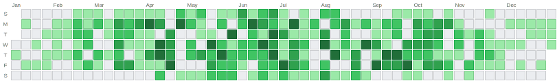
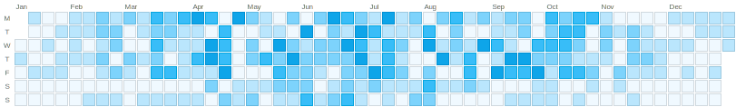

# HeatmapBuilder

A Ruby gem that generates embeddable SVG heatmap visualizations with GitHub-style calendar layouts and linear progress indicators. Perfect for Rails applications and any project that needs to display activity data in a visual format.


## Features

- GitHub-style calendar layouts for date-based data.
- Linear heatmaps.
- SVG format scales perfectly at any size.
- Shows numeric values in each cell.
- Parametric everything: customize cell size, spacing, colors, fonts, etc.
- Dynamic palette generation from two colors or manually-specified colors.
- OKLCH color interpolation for superior color transitions and perceptual uniformity.
- **Zero dependencies.**

## Installation

Add this line to your application's Gemfile:

```ruby
gem 'heatmap-builder'
```

And then execute:

    $ bundle

Or install it yourself as:

    $ gem install heatmap-builder

## Usage

### Linear Heatmaps

```ruby
require 'heatmap-builder'

# Generate SVG for daily scores
scores = [0, 1, 2, 3, 4, 5, 2, 1]
svg = HeatmapBuilder.build_linear(scores)

# In a Rails view
<%= raw HeatmapBuilder.build_linear(@daily_scores) %>
```


### Calendar Heatmaps

```ruby
# GitHub-style calendar heatmap
scores_by_date = {
  '2024-01-01' => 2,
  '2024-01-02' => 4,
  '2024-01-03' => 1,
  # ... more dates
}

svg = HeatmapBuilder.build_calendar(scores_by_date)
```

### Color Mapping

- Score `0`: Uses the first color (typically light gray)
- Score `1+`: Cycles through remaining colors based on score value

### Custom Configuration

#### Linear Heatmap Options

All options have defaults and are optional:

```ruby
HeatmapBuilder.build_linear(scores, {
  # Appearance
  cell_size: 10,              # Size of each square in pixels
  cell_spacing: 1,            # Space between squares in pixels
  font_size: 8,               # Font size for score text
  border_width: 1,            # Border width around each cell
  text_color: "#000000",      # Color of score text

  # Colors - can be an array of hex colors or a hash for OKLCH interpolation
  colors: HeatmapBuilder::GITHUB_GREEN,  # Array: %w[#ebedf0 #9be9a8 #40c463 #30a14e #216e39]
  # OR use OKLCH interpolation:
  # colors: { from: "#ebedf0", to: "#216e39", steps: 5 }
})
```

#### Calendar Heatmap Options

All options have defaults and are optional:

```ruby
HeatmapBuilder.build_calendar(scores_by_date, {
  # Appearance (inherits linear options)
  cell_size: 12,              # Size of each square in pixels (default 12 for calendar)
  cell_spacing: 1,            # Space between squares in pixels
  font_size: 8,               # Font size for labels
  border_width: 1,            # Border width around each cell
  text_color: "#000000",      # Color of label text
  colors: HeatmapBuilder::GITHUB_GREEN,  # Color palette

  # Calendar-specific options
  start_of_week: :monday,     # :sunday, :monday, :tuesday, :wednesday, :thursday, :friday, :saturday
  month_spacing: 5,           # Extra space between months in pixels
  show_month_labels: true,    # Show month names at top
  show_day_labels: true,      # Show day abbreviations on left
  show_outside_cells: false,  # Show inactive cells outside date range

  # Internationalization
  day_labels: %w[S M T W T F S],  # Day abbreviations starting from Sunday
  month_labels: %w[Jan Feb Mar Apr May Jun Jul Aug Sep Oct Nov Dec]  # Month abbreviations
})
```

#### Available Color Palettes

```ruby
HeatmapBuilder::GITHUB_GREEN   # %w[#ebedf0 #9be9a8 #40c463 #30a14e #216e39]
HeatmapBuilder::BLUE_OCEAN     # %w[#f0f9ff #bae6fd #7dd3fc #38bdf8 #0ea5e9]
HeatmapBuilder::WARM_SUNSET    # %w[#fef3e2 #fed7aa #fdba74 #fb923c #f97316]
HeatmapBuilder::PURPLE_VIBES   # %w[#f3e8ff #d8b4fe #c084fc #a855f7 #9333ea]
HeatmapBuilder::RED_TO_GREEN   # %w[#f5f5f5 #ff9999 #f7ad6a #d2c768 #99dd99]
```

```ruby
# Customize linear heatmap appearance
options = {
  cell_size: 35,           # Size of each square (default: 10)
  cell_spacing: 2,         # Space between squares (default: 1)
  font_size: 20,           # Font size for score text (default: 8)
  border_width: 2,         # Border thickness (default: 1)
  colors: %w[
    #ebedf0
    #9be9a8
    #40c463
    #30a14e
    #216e39
  ]
}

svg = HeatmapBuilder.build_linear([1, 2, 3, 4, 5, 6, 7], options)
```

TBD: Add generated SVG here


```ruby
# Calendar heatmap options
calendar_options = {
  cell_size: 14,                    # Size of each cell (default: 12)
  start_of_week: :sunday,           # :monday (default) or :sunday
  show_outside_cells: true,         # Show cells outside date range (default: false)
  show_month_labels: true,          # Show month names (default: true)
  show_day_labels: true,            # Show day abbreviations (default: true)
  day_labels: %w[S M T W T F S],    # Custom day labels (default: S M T W T F S)
  month_labels: %w[Jan Feb Mar Apr May Jun Jul Aug Sep Oct Nov Dec] # Custom month labels
}

svg = HeatmapBuilder.build_calendar(scores_by_date, calendar_options)
```




### Predefined Color Palettes

HeatmapBuilder includes a number of beautiful predefined color palettes:

#### Linear Heatmap Examples

```ruby
HeatmapBuilder.build_linear(scores, colors: HeatmapBuilder::GITHUB_GREEN)
```

TBD: Add SVG example

```ruby
HeatmapBuilder.build_linear(scores, colors: HeatmapBuilder::BLUE_OCEAN)
```


```ruby
HeatmapBuilder.build_linear(scores, colors: HeatmapBuilder::WARM_SUNSET)
```


```ruby
HeatmapBuilder.build_linear(scores, colors: HeatmapBuilder::PURPLE_VIBES)
```


```ruby
HeatmapBuilder.build_linear(scores, colors: HeatmapBuilder::RED_TO_GREEN)
```


#### Calendar Heatmap Examples

TBD: Add code example and SVG for default colors

TBD: Add code example to each SVG (assuming data already defined)




### Dynamic Palettes Generation

Generate custom color palettes from any two colors using OKLCH color space for superior color interpolation:

```ruby
# Generate a 5-step palette from red to blue
custom_colors = {
  from: "#ff0000",
  to: "#0000ff",
  steps: 5
}

svg = HeatmapBuilder.build_linear(scores, colors: custom_colors)
```

The OKLCH color space ensures perceptually uniform color transitions, making gradients appear smooth and natural to the human eye.

### I18n

TBD: Add a note on i18n (can be done via custmizing day_labels and month_labels)

## Development

After checking out the repo, run `bin/setup` to install development dependencies. Run tests with:

```bash
ruby -Ilib:test test/heatmap_builder_test.rb
```

To install this gem onto your local machine, run `bundle exec rake install`.

To generate all example SVG files you see in this readme:

```bash
ruby examples/generate_samples.rb
```

## Contributing

Bug reports and pull requests are welcome on GitHub at https://github.com/dreikanter/heatmap-builder. This project is intended to be a safe, welcoming space for collaboration, and contributors are expected to adhere to the [Contributor Covenant](http://contributor-covenant.org) code of conduct.

## License

The gem is available as open source under the terms of the [MIT License](https://opensource.org/licenses/MIT).

## Code of Conduct

Everyone interacting in the HeatmapBuilder project's codebases, issue trackers, chat rooms and mailing lists is expected to follow the [code of conduct](https://github.com/dreikanter/heatmap-builder/blob/master/CODE_OF_CONDUCT.md).
