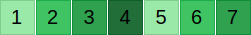

# HeatmapBuilder

A Ruby gem that generates embeddable SVG heatmap visualizations with GitHub-style calendar layouts and linear progress indicators. Perfect for Rails applications and any project that needs to display activity data in a visual format.


## Features

- 📅 **Calendar heatmaps**: GitHub-style calendar layouts for date-based data
- 📊 **Linear heatmaps**: Traditional progress indicator bars
- 🎨 **Parametric styling**: Customize cell size, spacing, colors, fonts, and borders
- 🔢 **Score display**: Shows actual numeric values in each cell
- 🎯 **Zero dependencies**: No external runtime dependencies
- 🚀 **Rails ready**: Works seamlessly with Rails views using `raw` helper
- 📱 **Responsive**: SVG format scales perfectly at any size
- 🎨 **Smart contrast**: Automatically chooses readable text colors
- ⚡ **Fast**: Generates SVG strings quickly for real-time use

## Installation

Add this line to your application's Gemfile:

```ruby
gem 'heatmap-builder'
```

And then execute:

    $ bundle

Or install it yourself as:

    $ gem install heatmap-builder

## Usage

### Linear Heatmaps

```ruby
require 'heatmap-builder'

# Generate SVG for daily scores
scores = [0, 1, 2, 3, 4, 5, 2, 1]
svg = HeatmapBuilder.generate(scores)

# In a Rails view
<%= raw HeatmapBuilder.generate(@daily_scores) %>
```


### Calendar Heatmaps

```ruby
# GitHub-style calendar heatmap
scores_by_date = {
  '2024-01-01' => 2,
  '2024-01-02' => 4,
  '2024-01-03' => 1,
  # ... more dates
}

svg = HeatmapBuilder.generate_calendar(scores_by_date)
```

### Custom Configuration

```ruby
# Customize linear heatmap appearance
options = {
  cell_size: 35,           # Size of each square (default: 20)
  cell_spacing: 1,         # Space between squares (default: 2)
  font_size: 20,           # Font size for score text (default: 12)
  colors: %w[              # Custom color palette (default: GitHub-style)
    #f0f0f0
    #c6e48b
    #7bc96f
    #239a3b
    #196127
  ]
}

svg = HeatmapBuilder.generate([1, 2, 3, 4, 5, 6, 7], options)
```



```ruby
# Calendar heatmap options
calendar_options = {
  cell_size: 14,
  start_of_week: :sunday,    # :monday (default) or :sunday
  show_outside_cells: true   # Show cells outside date range
}

svg = HeatmapBuilder.generate_calendar(scores_by_date, calendar_options)
```


### Color Mapping

- Score `0`: Uses the first color (typically light gray)
- Score `1+`: Cycles through remaining colors based on score value
- Higher scores automatically map to available colors in the palette

## Development

After checking out the repo, run `bin/setup` to install dependencies. Run tests with:

```bash
ruby -Ilib:test test/heatmap_builder_test.rb
```

To install this gem onto your local machine, run `bundle exec rake install`.

To generate all example SVG files you see in this readme:

```bash
ruby examples/generate_samples.rb
```

## Contributing

Bug reports and pull requests are welcome on GitHub at https://github.com/dreikanter/heatmap-builder. This project is intended to be a safe, welcoming space for collaboration, and contributors are expected to adhere to the [Contributor Covenant](http://contributor-covenant.org) code of conduct.

## License

The gem is available as open source under the terms of the [MIT License](https://opensource.org/licenses/MIT).

## Code of Conduct

Everyone interacting in the HeatmapBuilder project's codebases, issue trackers, chat rooms and mailing lists is expected to follow the [code of conduct](https://github.com/dreikanter/heatmap-builder/blob/master/CODE_OF_CONDUCT.md).
